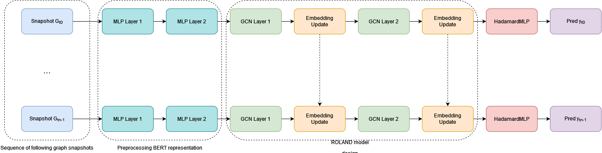

# Node Embedding Shift in Online Social Networks

Use of Temporal Graph Neural Networks to analyze how users behave before, during, and after a shocking event in an online social network (OSN) through node embedding shift.

The case study is a user migration from Steemit, the most well-known Blockchain-based OSN, to Hive, due to an hard-fork event.

This repository contains information, data and code behind the work: SUBMITTED.


# Dataset
Due to privacy reasons on personal data like username and textual content, we can't release the dataset related to Steemit. To patch this problem, we provide an anonymized version of our data. This version represents the final mathematical objects that are use to feed the models. For data gathering you can refer to the [Steemit API documentation](https://developers.steem.io/). 

Data related to the period affected by the shocking event are available in this repo in the zip `steemit-hardfork-data.zip`. To use them in the notebook of experiments, you need to unzip the file in a folder with the same name on the same level. For data related to the "stable" period in 2016 you can refer to [Temporal Graph Learning for dynamic link prediction with text in Online Social Networks](https://link.springer.com/article/10.1007/s10994-023-06475-x).

# Experiments

## Command Line

To reproduce the experiments of the paper, you can use the following script:
```
python nodeshift.py --data steemit-hardfork-data --feature <struct|text> [--sbert_only]
```
The results will be available in the "results" folder. `steemit-hardfork-data` must be the folder that contains the unzipped files of `steemit-hardfork-data.zip`

## Interactive Notebook
The notebook `TGNN-SteemitHardFork.ipynb` contains all the materials to reproduce the experiments on the period affected by the shocking event.

## Model architecture
The figure below shows the running architecture of the TGNN model.
. 

We report the architecture configuration in the following table: 

| Layer                     | input_channels | output_channels |
|---------------------------|----------------|-----------------|
| Preprocessing layer (MLP) | 384            | 256             |
| Preprocessing layer (MLP) | 256            | 128             |
| Graph Convolution (GCN)   | 128            | 64              |
| Embedding Update (GRU)    | 64             | 64              |
| Graph Convolution (GCN)   | 64             | 32              |
| Embedding Update (GRU)    | 32             | 32              |
| Decoder (HadamardMLP)     | 32             | 2               | 

We report the configuration of hyperparameters for the future link prediction task in the following table: 

| Hyperparameter | Value |
|----------------|-------|
| Optimizer      | Adam  |
| Learning rate  | 0.01  |
| Weight Decay   | 5e-3  |
| Epochs         | 50    |


